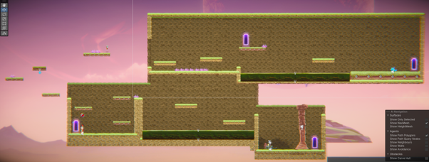
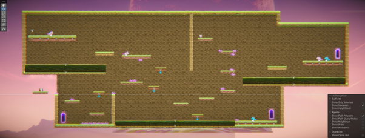

# COMP2150  - Level Design Document
### Name: [Rabi Attaii]
### Student number: [47180129] 

## 1. Player Experience (~700 words)

### 1.1. Discovery
When designing the levels for the game I started simple and added platforms first before adding obstacles and enemies. I had to make sure that the movement for the area was solid. The first area of the game teaches the player the mechanics of the game through general playing. At the start I placed a couple of platforms to show that you can jump in the game. From there I split the path into two. One looks more daunting due to the spike and acid floor while the other looks a lot easier. If they chose the harder route, they would be rewarded with a weapon. Which they then must use to get to the teleporter. If they went for the easier route, they would end up getting the key, but missing the weapon. 
Near the teleport to the 2nd area, I placed an enemy to show the player that they need a weapon to fight. If they still decide to continue to the next level without one, there’s a teleport they can find that’ll bring them back to area 1. The same was done with area 2. I feel this introduces all the main mechanics of the game in a straightforward manner. 

### 1.2. Drama
Area one was made to be easy but still includes moments of tension like with the enemy at the end and the acid floor. This makes the moments of relief in area one more common. Area two takes this tension and turns it up. There are more spikes, more enemies, the platforms have tighter timings to jump on, and there are more acid pools. This displays to the player that they must use what they learnt in the first area and start to master it if they want to complete the area. But there are still a few moments of relief. Getting the key, health packs, and reaching the teleport, all of these can be seen as tension relieving. I feel this makes the moments of relief much stronger for the player. Games like the original Resident Evil did this in the best possible way. And while I did not capture that, I feel it still makes the drama of the areas impactful. Most of the time this area is very intense as I was going for a more difficult platformer. 

### 1.3. Challenge
Originally, I had planned to place more enemies and environmental hazards, but it made the areas too difficult. So, I got rid of unnecessary things and unfair moments as I demo’d the game. By the end, this made my areas challenging while still being fair. Leading to much tighter level design. The timings for the platforms can be tight but are rewarding to pull off. If you try to rush, you end up being punished by missing the timing. 
The enemies can attack you while you’re on a platform, but you can jump to them and eliminate them. There are spikes placed in various areas, but all of the jumps are possible. I made sure they were not too tight because otherwise it would get boring just failing the jump over and over. Controlling the challenge of the game is important because of that. I made sure that there was a way for the player to tackle each challenge without giving the enemies an unfair advantage. 

### 1.4. Exploration
I made it so each area has a couple of different routes you can branch of to. Each route has something at the end to reward reaching it. One route would lead to the key, another would lead to a teleport to the next area, and the last would lead to a teleport to the previous area in case they missed something. I made sure there were teleports going to previous areas so that the player would not have to start all over just because they missed a key or weapon. It is up to the player to choose what route they feel like tackling first. And if they find it too challenging, they can come back and try again later. I also wanted to include switches or pressure plates that unlocked teleports as well, but I could not figure them out. 

## 2. Core Gameplay (~400 words)
A section on Core Gameplay, where storyboards are used to outline how you introduce the player to each of the required gameplay elements in the first section of the game. Storyboards should follow the format provided in lectures.

Storyboards can be combined when multiple mechanics are introduced within a single encounter. Each section should include a sentence or two to briefly justify why you chose to introduce the mechanic/s to the player in that sequence.

You should restructure the headings below to match the order they appear in your level.

### 2.1. Acid

### 2.2. Checkpoints

### 2.3. Chompers

### 2.4. Health Pickups

### 2.5. Keys

### 2.6. Moving Platforms

### 2.7. Passthrough Platforms

### 2.8. Spikes

### 2.9. Spitters

### 2.10. Weapon Pickup (Gun)

### 2.11. Weapon Pickup (Staff)

## 3. Spatiotemporal Design
A section on Spatiotemporal Design, which includes your molecule diagram and annotated level maps (one for each main section of your level). These diagrams may be made digitally or by hand, but must not be created from screenshots of your game. The annotated level maps should show the structure you intend to build, included game elements, and the path the player is expected to take through the level. Examples of these diagrams are included in the level design lectures.

No additional words are necessary for this section (any words should only be within your images/diagrams).
 
### 3.1. Molecule Diagram

### 3.2. Level Map – Section 1

### 3.3.	Level Map – Section 2

### 3.4.	Level Map – Section 3

## 4. Iterative Design (~400 words)
Reflect on how iterative design helped to improve your level. Additional prototypes and design artefacts should be included to demonstrate that you followed an iterative design process (e.g. pictures of paper prototypes, early grey-boxed maps, additional storyboards of later gameplay sequences, etc.). You can also use this section to justify design changes made in Unity after you drew your level design maps shown in section 3. 

You should conclude by highlighting a specific example of an encounter, or another aspect of your level design, that could be improved through further iterative design.

## Generative AI Use Acknowledgement

Use the below table to indicate any Generative AI or writing assistance tools used in creating your document. Please be honest and thorough in your reporting, as this will allow us to give you the marks you have earnt. Place any drafts or other evidence inside this repository. This form and related evidence do not count to your word count.
An example has been included. Please replace this with any actual tools, and add more as necessary.

### Tool Used: ChatGPT
**Nature of Use** Finding relevant design theory.

**Evidence Attached?** Screenshot of ChatGPT conversation included in the folder "GenAI" in this repo.

**Additional Notes:** I used ChatGPT to try and find some more relevant design theory that I could apply to my game. After googling them, however, I found most of them were inaccurate, and some didn't exist. One theory mentioned, however, was useful, and I've incorporated it into my work.

### Tool Used: Example
**Nature of Use** Example Text

**Evidence Attached?** Example Text

**Additional Notes:** Example Text

