
# COMP2150  - Level Design Document
### Name: [Rabi Attaii]
### Student number: [47180129] 

## 1. Player Experience (~700 words)

### 1.1. Discovery
When designing the levels for the game I started simple and added platforms first before adding obstacles and enemies. I had to make sure that the movement for the area was solid. The first area of the game teaches the player the mechanics of the game through general playing. At the start, I placed a couple of platforms to show that you can jump in the game. From there I split the path into two. One looks more daunting due to the spike and acid floor while the other looks a lot easier. If they chose the harder route, they would be rewarded with a weapon. Which they then must use to get to the teleporter. If they went for the easier route, they would end up getting the key, but missing the weapon. 
Near the teleport to the 2nd area, I placed an enemy to show the player that they need a weapon to fight. If they still decide to continue to the next level without one, there’s a teleport they can find that’ll bring them back to area 1. The same was done with area 2. I feel this introduces all the main mechanics of the game straightforwardly. 

### 1.2. Drama
Area one was made to be easy but still includes moments of tension like with the enemy at the end and the acid floor. This makes the moments of relief in area 1 more common. Area two takes this tension and turns it up. There are more spikes and more enemies, the platforms have tighter timings to jump on, and there are more acid pools. This displays to the player that they must use what they learnt in the first area and start to master it if they want to complete the area. But there are still a few moments of relief. Getting the key, health packs, and reaching the teleport, all of these can be seen as tension relieving. I feel this makes the moments of relief much stronger for the player. Games like the original Resident Evil did this in the best possible way. And while I did not capture that, I feel it still makes the drama of the areas impactful. Most of the time this area is very intense as I was going for a more difficult platformer.

### 1.3. Challenge
Originally, I had planned to place more enemies and environmental hazards, but it made the areas too difficult. So, I got rid of unnecessary things and unfair moments as I demo’d the game. In the end, this made my areas challenging while still being fair. Leading to much tighter level design. The timings for the platforms can be tight but are rewarding to pull off. If you try to rush, you end up being punished by missing the timing. 
The enemies can attack you while you’re on a platform, but you can jump to them and eliminate them. There are spikes placed in various areas, but all of the jumps are possible. I made sure they were not too tight because otherwise it would get boring just failing the jump over and over. Controlling the challenge of the game is important because of that. I made sure that there was a way for the player to tackle each challenge without giving the enemies an unfair advantage. 

### 1.4. Exploration
I made it so each area has a couple of different routes you can branch off to. Each route has something at the end to reward reaching it. One route would lead to the key, another would lead to a teleport to the next area, and the last would lead to a teleport to the previous area in case they missed something. I made sure teleporters were going to previous areas so that the player would not have to start all over just because they missed a key or weapon. It is up to the player to choose what route they feel like tackling first. And if they find it too challenging, they can come back and try again later. I also wanted to include switches or pressure plates that unlocked teleports as well, but I could not figure them out.

## 2. Core Gameplay (~400 words)

### 2.1. Passthrough Platforms
Passthrough platforms are the first elements introduced in my design. It was put there so that the player would know that they can jump in the game, and it is there to warm them up before getting to the challenging jumps. 

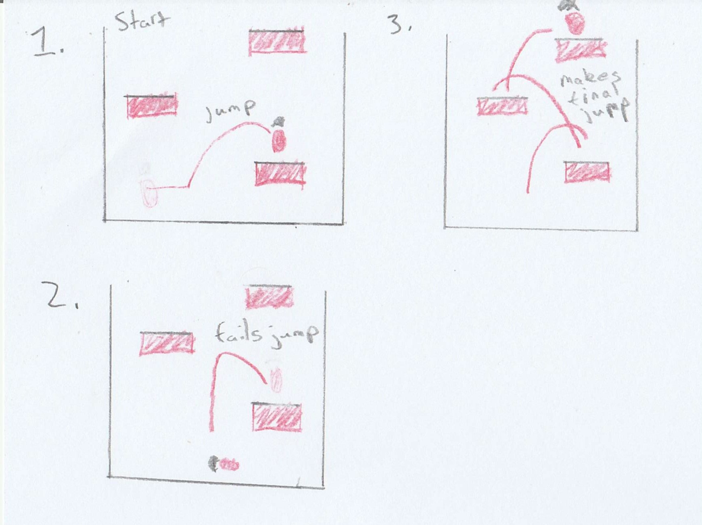

### 2.2. Moving Platforms & Acid & Weapon Pickup (Gun) & Weapon Pickup (Staff) 
The combination of these elements makes for a more thrilling encounter. It is the encounter right after the first one so it introduces the player to moving versions of the platforms they saw, an acid pool beneath them to show that missing the jump will hurt. And a weapon pick-up as a reward for making it through the jumps. I chose to place this here to show the player that good timing is necessary to finish these areas.

&WeaponPickup(Staff).jpg)

### 2.3. Spikes & Keys
Spikes were used similarly to the acid in the previous encounter. It is used to punish impatient players as well as to show the player that where they jump on platforms is also important. Over or under-jumping can lead to landing on spikes. The key was placed beside spikes because of that. It is there to reward players who made the tighter jump and did not overjump. 

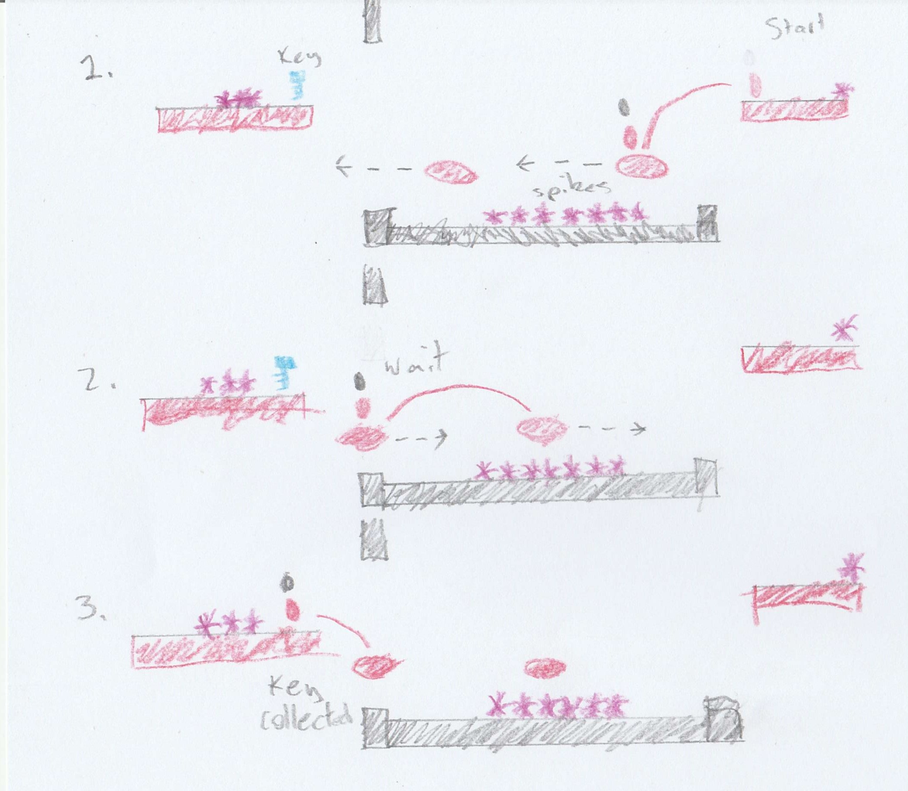

### 2.4. Spitters
Spitters are the last encounter in the first area of the game. They are there to make the player use the weapon they got after one of the first encounters. If they go the other way and get the key first, they will be missing the weapon, so the enemy is there to also remind the player that they need to get a weapon. If they do not have one at that point, they can go back and look for it. 

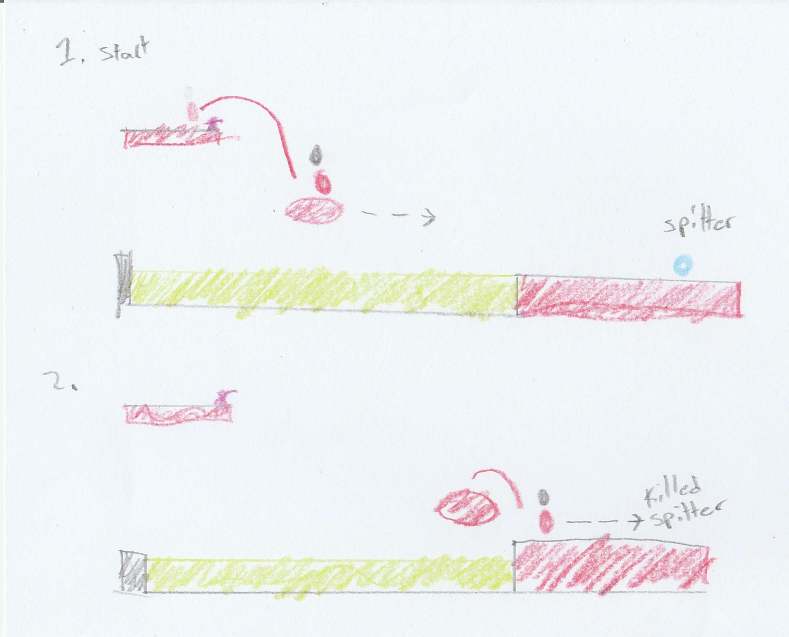

### 2.5. Checkpoints & Health Pickups
A checkpoint is placed at the start of each area. I did this because the areas are fairly small and do not need multiple checkpoints per area. Placing it at the start also allows the player to try a different route or tackle an encounter differently if they feel what they are trying to do is not working. The health pick-up was placed as a risk-reward here. The spikes make the jumps tight, but they will be rewarded with a health point for pulling it off. 

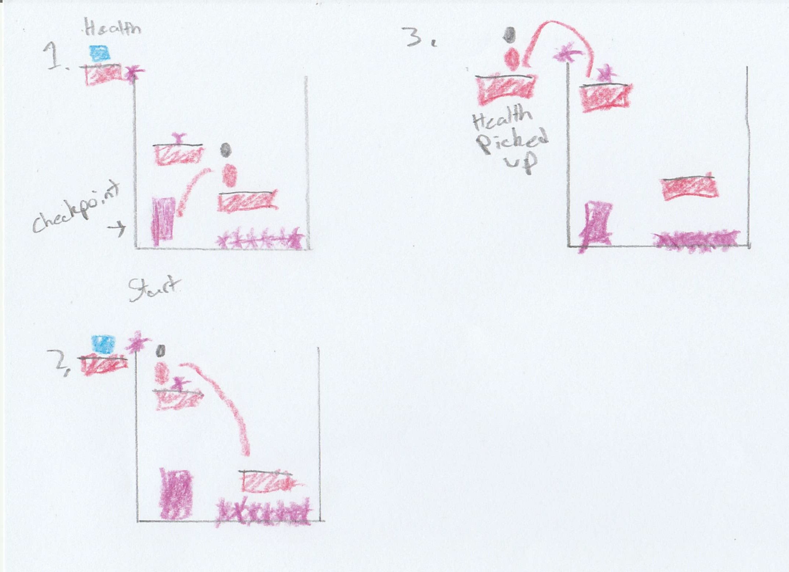

### 2.6. Chompers
Chompers are much more aggressive than spitters since they run after you rather than sitting still and spitting attacks in a rhythm. The encounter I’ve shown is a rather difficult one where they need to make a series of jumps avoiding spikes and acid, then the player has to deal with both a chomper and spitter. I did this because it is the final encounter in area 2 and tests all the gameplay mechanics they had been introduced to at that point.

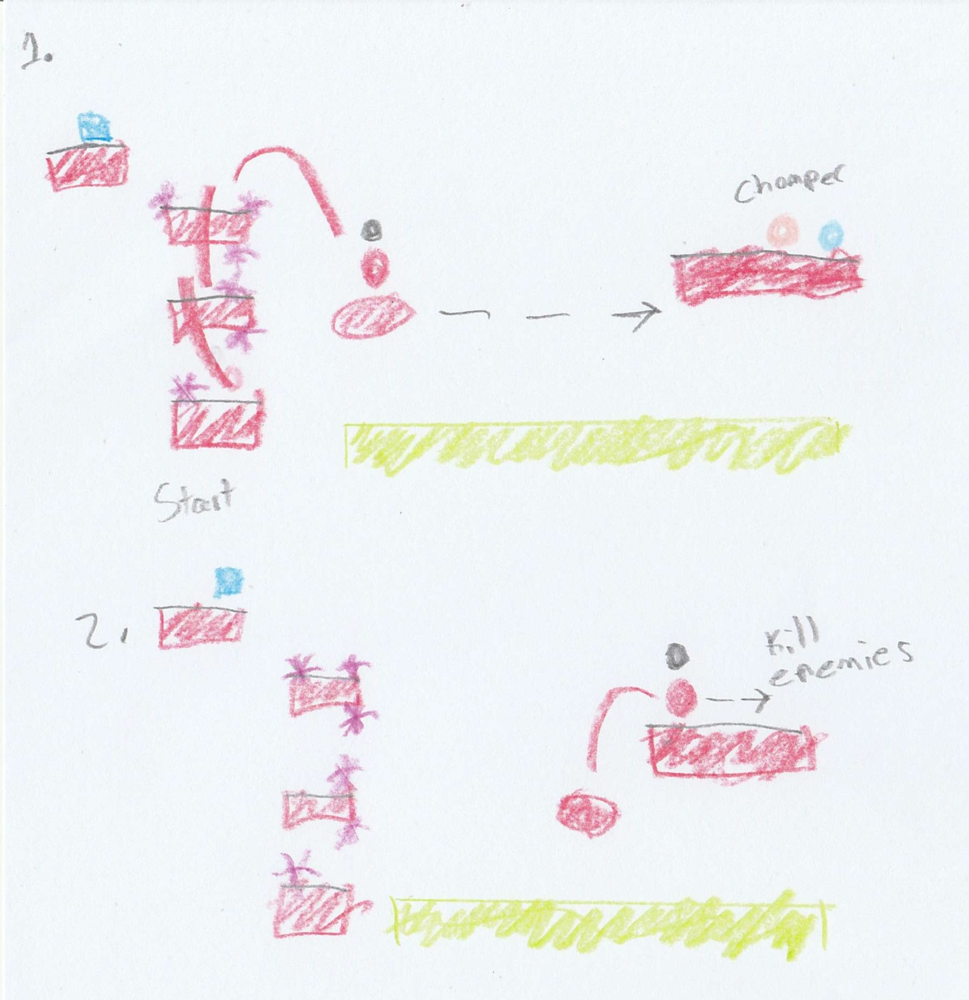

## 3. Spatiotemporal Design

 
### 3.1. Molecule Diagram

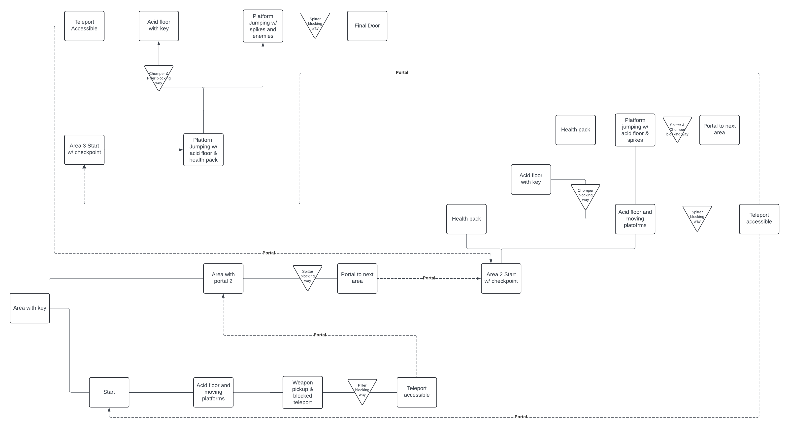

### 3.2. Level Map – Section 1

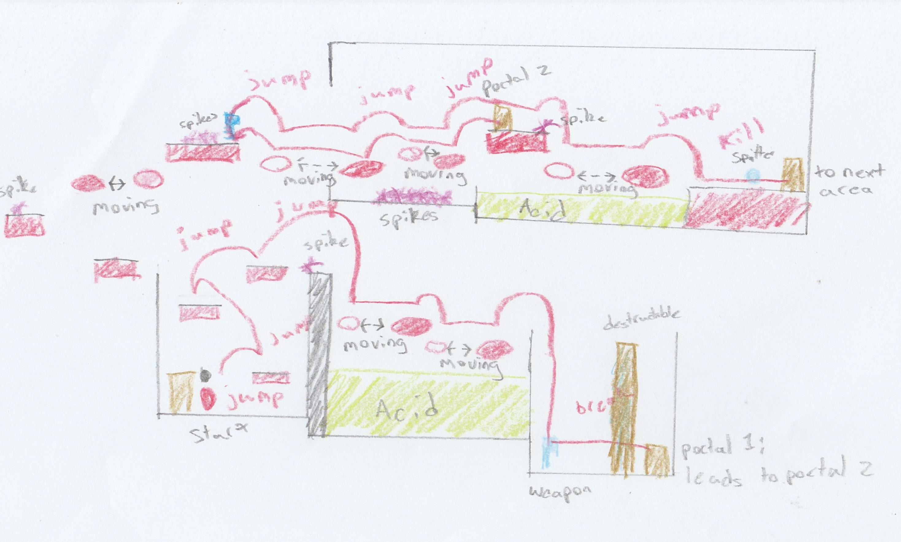

### 3.3. Level Map – Section 2

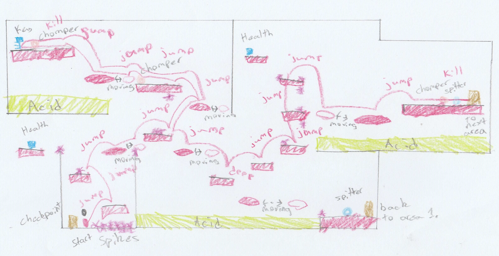

### 3.4. Level Map – Section 3

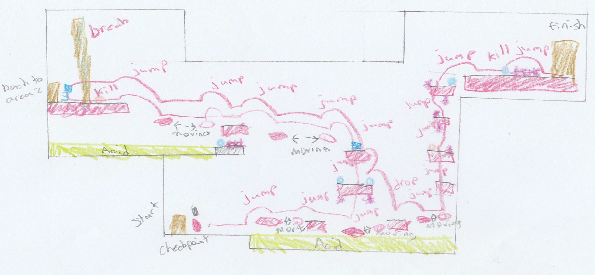

## 4. Iterative Design (~400 words)

Iterative design was used to build all of my areas. The areas were originally drawn on a couple of pieces of paper as well as a diagram. All of those are in section 3. To show how I wanted the areas to flow. I then put that into Unity without any tile mapping or editing. After playing the area a few times, I then corrected the placements for everything. Some platforms were too far or too small. Some enemies' attack ranges were too wide. Some platforms got in the way of others. Acid pools were not done yet. All of these were adjusted with each playtest I did. After that, I did all the tile mapping and then adjusted the prefabs once again to fit. Because of the tile mapping some of the platforms were blocked so I had to make them smaller or adjust placement. 

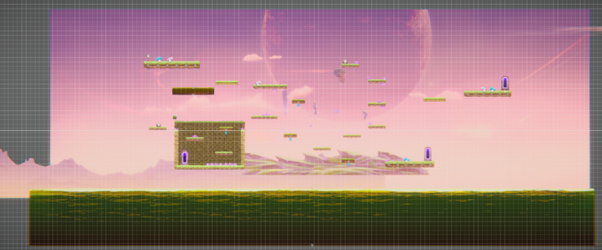

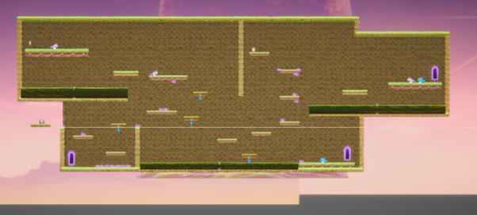

I wanted to place and use pressure plates and switches to add puzzles to the design of the areas. Without puzzles, my design feels like it is lacking. You can see this with the overall design of the areas. They mainly focus on jumping and timing and lack much-needed intellectual thinking. If puzzles were added I could experiment more with enemy placement, drama, challenge, exploration, and reward. While the areas have the necessary challenge, it feels like it really lacks exploration. There are routes you can take but almost all of them lead to items you need to continue rather than cool distractions. For example, area 3 feels like it lacks things you can do in it. I would have loved to make an encounter with respawnable enemies, a pressure plate, and a box. I would have made it so the enemies kept respawning in intervals while the player would have to find and push the box to the pressure plate. This would then unlock the encounter in the top left corner where you can get the key. 

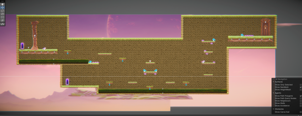

## Generative AI Use Acknowledgement

### Tool Used: Grammarly
**Nature of Use** Fixing small errors within my sentences

**Evidence Attached?** "I feel this introduces all the main mechanics of the game in a straightforward manner." was changed to "I feel this introduces all the main mechanics of the game straightforwardly."

**Additional Notes:** I used Grammarly to correct some tense issues as well as spotting errors in my spelling or how a sentence read. Not all corrections were used since a number of them were poor choices. 

